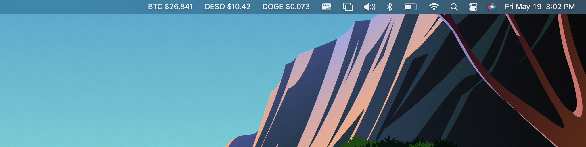

xbar-CRYPTO
====================

xbar-CRYPTO is a set of bash scripts that fetch and display the current USD prices of various cryptocurrencies in the macOS menu bar using the xbar app.

Table of Contents
-----------------
- [Script Features](#script-features)
- [Requirements](#requirements)
- [Running the Scripts using a terminal](#running-the-scripts-using-a-terminal)
- [Running the Scripts using xbar](#running-the-scripts-using-xbar)
- [Code Structure](#code-structure)
- [Contributing](#contributing)
- [License](#license)

Script Features
---------------
- Fetches current USD prices of BTC, DESO, & DOGE in a terminal.
- Displays real-time (refreshes every minute) USD prices of BTC, DESO, & DOGE in the macOS menu bar using xbar.
- Individual scripts for each cryptocurrency as well as a combinatory script.
- Uses the Coinbase API for accurate and reliable data.

Requirements
------------
To run the scripts, you'll need the following software:
- shell
- curl
- awk
- xbar

Running the Scripts using a terminal
------------------------------------
1. Clone the repository to your local machine:
```
git clone https://github.com/andrew-awsma/xbar-crypto.git
```
Alternatively, you can download the repository as a ZIP file and extract it to a desired location.

2. Navigate to the directory of the cloned repository.

3. Run the script(s) you're interested in. For example, to run the script for DESO price, use the following command:
```
bash 003-desousd.1m.sh
```

Running the Scripts using xbar
------------------------------
1. Clone the repository to your local machine:
```
git clone https://github.com/andrew-awsma/xbar-crypto.git
```
Alternatively, you can download the repository as a ZIP file and extract it to a desired location.

2. Ensure that xbar is installed on your macOS. If not, download and install it from the [official website](https://xbarapp.com) or [GitHub repository](https://github.com/matryer/xbar).

3. Once installed, open xbar. Click on the xbar menu (in the macOS menu bar), choose Open plugin folder... to open the Plugin Directory within Finder.

4. This directory is a folder on your Mac where the plugins live, located at ~/Library/Application Support/xbar/plugins.

5. Navigate to the directory of the cloned repository or downloaded zip file (extract the contents) and copy a script (001-cryptousd.1m.sh, 002-dogeusd.1m.sh, 003-desousd.1m.sh, and 004-btcusd.1m.sh) to the Plugin Directory.

6. After copying a script, click on the xbar menu (in the macOS menu bar), then click Refresh All and it should automatically display the script output in your macOS menu bar.

7. Keep in mind, whatever script or scripts that are placed in the Plugin Directory will all be displayed in the macOS menu bar, all at once.

8. If you only want to display one script at a time, just create a folder within the Plugin Directory (you can name it whatever you want) and place the scripts that you dont want to display in that folder. Then you can just switch them in an out depending on which script you want to display.

Code Structure
--------------
The code is organized into individual bash scripts for each cryptocurrency:

- `001-cryptousd.1m.sh`: Fetches and displays the prices of BTC, DESO, & DOGE in USD.
- `002-dogeusd.1m.sh`: Fetches and displays the price of DOGE in USD.
- `003-desousd.1m.sh`: Fetches and displays the price of DESO in USD.
- `004-btcusd.1m.sh`: Fetches and displays the price of BTC in USD.

Contributing
------------
Contributions are welcome! If you'd like to contribute, please follow these steps:

1. Fork the repository.
2. Clone your forked repository to make changes.
3. Create a new branch for your feature or bug fix.
4. Commit your changes and push them to your fork.
5. Create a pull request to the original repository.

Please make sure your code follows best coding practices and include any necessary documentation.

License
-------
xbar-CRYPTO is licensed under the MIT License. You are free to use, modify, and distribute this code, as long as attribution is provided and you include the license notice and follow its terms and conditions.
